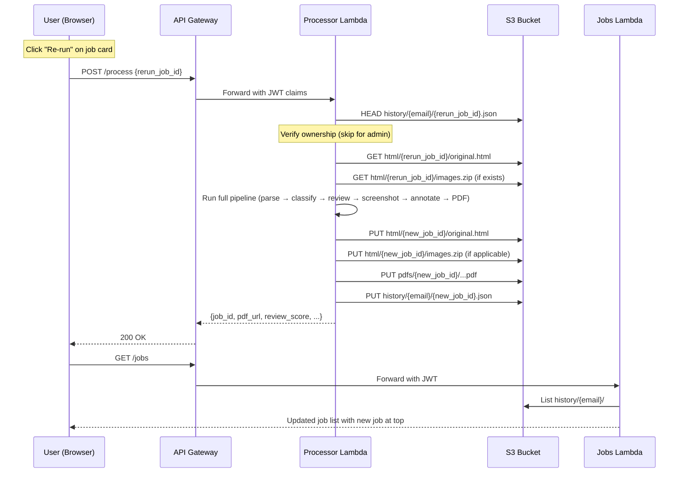

# Design Document: Re-run Annotation

## Overview

This feature enables users to re-run annotation jobs from the History page without re-uploading the original HTML file. The system persists the original HTML (and optional images ZIP) in S3 during initial processing, then allows one-click re-processing using the latest pipeline code.

The design touches four layers:
1. **Backend (handler.py)** — Persist HTML/images on first run; load them on re-run; ownership verification
2. **Backend (jobs_handler.py)** — Include `images_s3_key` in job records for re-run awareness
3. **Frontend (HistoryPage.jsx)** — Re-run button on each job card with loading/error states
4. **Infrastructure (annotator_stack.py)** — S3 lifecycle rule for `html/` prefix (90-day expiry)

### Design Decisions

1. **Separate `html/` prefix** rather than embedding HTML in the job record JSON. HTML files can be several MB; keeping them separate avoids bloating the lightweight job record that the Jobs Lambda reads on every history load.

2. **Copy images ZIP to persistent location** instead of skipping cleanup. The current `finally` block deletes the uploaded ZIP from `uploads/`. We copy it to `html/{job_id}/images.zip` before cleanup so re-runs have access to images without requiring re-upload.

3. **New job_id per re-run** so the original job record is never mutated. The re-run result is a fully independent job with its own history entry, PDF, and stored HTML.

4. **Ownership check via S3 key existence** rather than a separate authorization table. Since job records live at `history/{user_email}/{job_id}.json`, checking for that key's existence confirms ownership. Admins bypass this check.

## Architecture



## Components and Interfaces

### 1. Processor Lambda — `handler.py`

#### Modified: `_handle_process(event)`

The existing handler gains a new code path at the top:

```python
def _handle_process(event: dict) -> dict:
    body = json.loads(event.get("body", "{}"))
    rerun_job_id = body.get("rerun_job_id", "")

    if rerun_job_id:
        return _handle_rerun(event, body, rerun_job_id)

    # ... existing processing logic unchanged ...
```

#### New: `_handle_rerun(event, body, rerun_job_id)`

Responsibilities:
- Extract `user_email` and `groups` from JWT claims
- Verify ownership: check `history/{user_email}/{rerun_job_id}.json` exists (skip for admin)
- Load original HTML from `html/{rerun_job_id}/original.html`
- Load original job record to get `filename`, `subject_line`, `preheader_text` defaults
- Check for stored images ZIP at `html/{rerun_job_id}/images.zip`
- Generate new `job_id`
- Delegate to existing pipeline logic
- Persist HTML (and images if applicable) under new job_id

#### Modified: Pipeline completion (HTML persistence)

After step 11 (persist job record), add:

```python
# 12. Persist original HTML for future re-runs
try:
    s3.put_object(
        Bucket=BUCKET,
        Key=f"html/{job_id}/original.html",
        Body=html_content_original,  # pre-rewrite content
        ContentType="text/html",
    )
except Exception as e:
    print(f"[WARN] Failed to persist HTML for job {job_id}: {e}")
```

#### Modified: Images ZIP handling

When `images_s3_key` is provided, copy the ZIP to persistent storage before the `finally` cleanup:

```python
# Copy images ZIP to persistent location
if images_s3_key:
    try:
        s3.copy_object(
            Bucket=BUCKET,
            CopySource={"Bucket": BUCKET, "Key": images_s3_key},
            Key=f"html/{job_id}/images.zip",
        )
    except Exception as e:
        print(f"[WARN] Failed to persist images ZIP for job {job_id}: {e}")
```

#### Modified: Job record schema

Add two new optional fields:

```python
job_record = {
    # ... existing fields ...
    "images_s3_key": images_s3_key or None,   # Req 1.3
    "rerun_from": rerun_job_id or None,        # Req 3.2
}
```

### 2. Frontend — `HistoryPage.jsx`

#### Modified: `JobCard` component

Add a "Re-run" button next to the PDF download link:

```jsx
function JobCard({ job, onRerun, rerunState }) {
    // rerunState: null | "processing" | "error" | "success"
    // ...existing layout...

    {/* Re-run button */}
    <button
        onClick={() => onRerun(job.job_id)}
        disabled={rerunState === "processing" || rerunState === "disabled"}
        className="rerun-btn"
    >
        {rerunState === "processing" ? "Processing…" : "↻ Re-run"}
    </button>
}
```

#### Modified: `HistoryPage` component

Add state management for re-run operations:

```jsx
const [rerunStates, setRerunStates] = useState({});  // {job_id: "processing"|"error"|"disabled"}
const [rerunErrors, setRerunErrors] = useState({});   // {job_id: "error message"}

async function handleRerun(jobId) {
    setRerunStates(prev => ({...prev, [jobId]: "processing"}));
    try {
        const session = await fetchAuthSession();
        const token = session.tokens.idToken.toString();
        const response = await post({
            apiName: "EmailAnnotatorAPI",
            path: "/process",
            options: {
                headers: { Authorization: token },
                body: { rerun_job_id: jobId },
            },
        }).response;
        const data = await response.body.json();
        if (data.job_id) {
            setRerunStates(prev => ({...prev, [jobId]: "success"}));
            loadHistory();  // refresh to show new job
        }
    } catch (err) {
        const errorData = JSON.parse(err?.response?.body || "{}");
        if (errorData.error === "HTML_NOT_FOUND") {
            setRerunStates(prev => ({...prev, [jobId]: "disabled"}));
            setRerunErrors(prev => ({...prev, [jobId]: "Original HTML not available for this job"}));
        } else {
            setRerunStates(prev => ({...prev, [jobId]: "error"}));
            setRerunErrors(prev => ({...prev, [jobId]: errorData.message || "Re-run failed"}));
        }
    }
}
```

### 3. Infrastructure — `annotator_stack.py`

#### Modified: S3 lifecycle rules

Add a new lifecycle rule for the `html/` prefix:

```python
s3.LifecycleRule(
    id="expire-html-90-days",
    prefix="html/",
    expiration=Duration.days(90),
),
```

This sits alongside the existing `pdfs/` (7-day) and `uploads/` (1-day) rules.

## Data Models

### S3 Key Structure (new keys in bold)

```
{bucket}/
├── uploads/{job_id}/images.zip          # Temporary (1-day expiry) — existing
├── pdfs/{job_id}/{filename}_annotated.pdf  # 7-day expiry — existing
├── history/{user_email}/{job_id}.json   # Job record — existing
├── **html/{job_id}/original.html**      # Original HTML — 90-day expiry (NEW)
└── **html/{job_id}/images.zip**         # Persistent images — 90-day expiry (NEW)
```

### Job Record Schema (updated)

```json
{
    "job_id": "a1b2c3d4",
    "filename": "campaign.html",
    "subject_line": "Spring Sale",
    "preheader_text": "Don't miss out",
    "recipient_email": "user@example.com",
    "pdf_key": "pdfs/a1b2c3d4/campaign_annotated.pdf",
    "pdf_url": "https://...",
    "status": "done",
    "created_at": "2025-01-15T10:30:00Z",
    "review_score": 85,
    "review_summary": "Good quality email with minor issues",
    "issue_counts": {"critical": 0, "warning": 2, "info": 3},
    "match_confidence": 92,
    "images_s3_key": "uploads/a1b2c3d4/images.zip",
    "rerun_from": null
}
```

New fields:
- `images_s3_key` (string|null) — The original upload key for the images ZIP. Stored for reference; the persistent copy lives at `html/{job_id}/images.zip`.
- `rerun_from` (string|null) — The `job_id` of the original job this was re-run from. `null` for first-run jobs.

### Re-run Request Body

```json
{
    "rerun_job_id": "a1b2c3d4",
    "recipient_email": "user@example.com",
    "subject_line": "",
    "preheader_text": ""
}
```

When `rerun_job_id` is present and `html_content` is absent, the handler treats it as a re-run. Optional fields (`subject_line`, `preheader_text`) override the original job's values if provided.

### Error Responses (new)

| Condition | HTTP Status | Error Code | Message |
|---|---|---|---|
| HTML not found in S3 | 404 | `HTML_NOT_FOUND` | "Original HTML not available for this job. It may have been processed before this feature was enabled." |
| User doesn't own job | 403 | `FORBIDDEN` | "You do not have permission to re-run this job." |


## Correctness Properties

*A property is a characteristic or behavior that should hold true across all valid executions of a system — essentially, a formal statement about what the system should do. Properties serve as the bridge between human-readable specifications and machine-verifiable correctness guarantees.*

### Property 1: HTML content preservation (round-trip)

*For any* valid HTML string submitted as `html_content` in a processing request, the content stored in S3 at `html/{job_id}/original.html` SHALL be byte-identical to the original input, before any image path rewriting is applied.

**Validates: Requirements 1.2**

### Property 2: Re-run field defaulting

*For any* re-run request and original job record, if a field (`filename`, `subject_line`, `preheader_text`) is provided in the re-run request body (non-empty string), the pipeline SHALL use the provided value; otherwise it SHALL use the corresponding value from the original job record.

**Validates: Requirements 2.2**

### Property 3: Re-run produces a new job_id

*For any* re-run request with a given `rerun_job_id`, the resulting job's `job_id` SHALL be different from the `rerun_job_id`.

**Validates: Requirements 2.3**

### Property 4: Authorization — ownership enforcement

*For any* user email, job_id, and admin status: if the user is not an admin and `history/{user_email}/{job_id}.json` does not exist in S3, the re-run request SHALL be rejected with HTTP 403. If the user is an admin, the re-run request SHALL proceed regardless of ownership.

**Validates: Requirements 2.6, 2.7**

### Property 5: Re-run traceability

*For any* re-run job, the resulting job record's `rerun_from` field SHALL equal the `rerun_job_id` from the request.

**Validates: Requirements 3.2**

## Error Handling

### Backend Error Scenarios

| Error | Handler | Response |
|---|---|---|
| HTML persistence fails (S3 put) | `_handle_process` | Log warning, continue pipeline — non-critical (Req 1.4) |
| Images ZIP copy fails (S3 copy) | `_handle_process` | Log warning, continue pipeline — non-critical |
| Original HTML not found (re-run) | `_handle_rerun` | HTTP 404, `{"error": "HTML_NOT_FOUND", "message": "..."}` (Req 2.5) |
| User doesn't own job (re-run) | `_handle_rerun` | HTTP 403, `{"error": "FORBIDDEN", "message": "..."}` (Req 2.7) |
| Images ZIP not found (re-run) | `_handle_rerun` | Proceed without images — graceful degradation (Req 6.3) |
| Original job record not found | `_handle_rerun` | HTTP 404, `{"error": "HTML_NOT_FOUND", "message": "..."}` |

### Frontend Error Handling

| Error Code | UI Behavior |
|---|---|
| `HTML_NOT_FOUND` | Show "Original HTML not available for this job", disable Re-run button permanently for that card (Req 4.6) |
| `FORBIDDEN` | Show "You do not have permission to re-run this job" on the card |
| Network/other error | Show generic error message on the affected card, other cards unaffected (Req 4.5) |

### Graceful Degradation Principles

1. HTML persistence failure does NOT fail the primary job — the user still gets their PDF
2. Missing images ZIP on re-run does NOT fail the re-run — the PDF renders without custom images
3. Error states are scoped to individual job cards — one failed re-run doesn't break the History page

## Testing Strategy

### Property-Based Tests (Hypothesis — Python)

The project already uses Hypothesis for property-based testing (see `backend/docker/tests/test_preservation.py`). The re-run feature adds 5 new properties.

**Library:** [Hypothesis](https://hypothesis.readthedocs.io/) (already in project dependencies)
**Minimum iterations:** 100 per property
**Tag format:** `Feature: rerun-annotation, Property {N}: {title}`

| Property | What to generate | What to assert |
|---|---|---|
| P1: HTML preservation | Random HTML strings (with tags, special chars, unicode) | Stored content == original input |
| P2: Field defaulting | Random field combinations (provided vs omitted) × random original values | Effective value = provided if non-empty, else original |
| P3: New job_id | Random rerun_job_id strings | new_job_id ≠ rerun_job_id |
| P4: Authorization | Random (email, job_id, is_admin, owns_job) tuples | 403 when !admin && !owns; success when admin or owns |
| P5: Traceability | Random rerun_job_id strings | job_record.rerun_from == rerun_job_id |

All property tests mock AWS services (S3, Bedrock, SES) to test pure logic without external calls.

### Unit Tests (pytest)

| Test | Type | Validates |
|---|---|---|
| HTML stored with correct S3 key and content type | Integration | Req 1.1 |
| images_s3_key included in job record when provided | Example | Req 1.3 |
| HTML persistence failure doesn't crash pipeline | Example | Req 1.4 |
| Re-run loads HTML from correct S3 key | Integration | Req 2.1 |
| Re-run uses JWT email, not original recipient | Example | Req 2.4 |
| 404 returned when HTML not in S3 | Example | Req 2.5 |
| Re-run HTML stored under new job_id | Integration | Req 3.1 |
| Re-run button renders on job card | Example | Req 4.1 |
| Re-run button sends correct POST payload | Example | Req 4.2 |
| Button disabled during processing | Example | Req 4.3 |
| Job list refreshes after successful re-run | Example | Req 4.4 |
| Error scoped to affected card only | Example | Req 4.5 |
| HTML_NOT_FOUND disables button | Example | Req 4.6 |
| Images ZIP copied to persistent location | Integration | Req 6.1 |
| Re-run uses stored images ZIP | Integration | Req 6.2 |
| Re-run succeeds without images ZIP | Example | Req 6.3 |

### Infrastructure Tests (CDK assertions)

| Test | Type | Validates |
|---|---|---|
| S3 lifecycle rule exists for `html/` prefix with 90-day expiry | Smoke | Req 5.1 |
