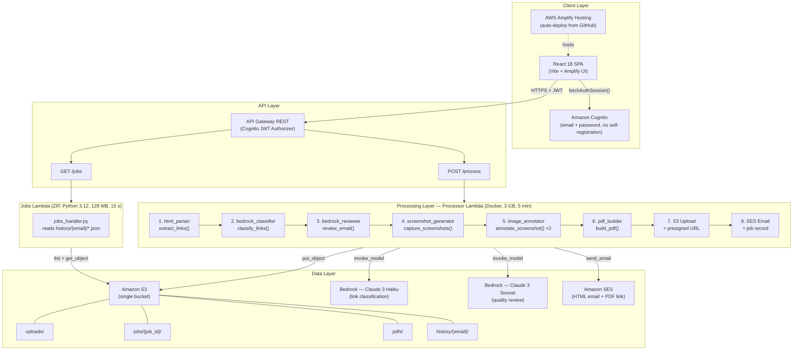

# Email Campaign Annotator — Developer Reference Guide

> Automates annotated PDF proof generation for HTML email campaigns at a pharmaceutical marketing agency. Replaces a 13-minute manual workflow (Outlook → Dreamweaver → Email on Acid → InDesign) with a fully automated AWS pipeline that delivers results in under 5 minutes.

---

## Table of Contents

- [Architecture Overview](#architecture-overview)
- [Prerequisites](#prerequisites)
- [Local Development Setup](#local-development-setup)
- [Project Directory Structure](#project-directory-structure)
- [Backend Module Reference](#backend-module-reference)
- [Frontend Authentication Flow](#frontend-authentication-flow)
- [CDK Stack Resources](#cdk-stack-resources)
- [Testing Strategy](#testing-strategy)
- [Adding a New Feature](#adding-a-new-feature)
- [Kiro Specification System](#kiro-specification-system)
- [Deployment Guide](#deployment-guide)
- [Environment Variables Reference](#environment-variables-reference)
- [Coding Standards](#coding-standards)

---

## Architecture Overview



---

## Prerequisites

| Tool | Version | Install Command |
|---|---|---|
| Python | 3.11+ | `brew install python@3.11` (macOS) or [python.org](https://www.python.org/downloads/) |
| Node.js | 18+ | `brew install node@18` or [nodejs.org](https://nodejs.org/) |
| Docker Desktop | Latest | [docker.com/products/docker-desktop](https://www.docker.com/products/docker-desktop/) |
| AWS CLI | v2 | `brew install awscli` or `curl "https://awscli.amazonaws.com/awscli-exe-linux-x86_64.zip" -o "awscliv2.zip" && unzip awscliv2.zip && sudo ./aws/install` |
| AWS CDK | v2 | `npm install -g aws-cdk` |
| Git | Latest | `brew install git` or `sudo apt install git` |

Verify your installations:

```bash
python3 --version    # 3.11+
node --version       # 18+
docker --version     # 24+
aws --version        # aws-cli/2.x
cdk --version        # 2.150+
git --version
```

---

## Local Development Setup

### 1. Clone the repository

```bash
git clone <repo-url> email-annotator
cd email-annotator
```

### 2. Configure AWS credentials

```bash
aws configure
# AWS Access Key ID: <your-key>
# AWS Secret Access Key: <your-secret>
# Default region name: us-east-1
# Default output format: json
```

### 3. Set environment variables

Create a `.env` file or export directly:

```bash
export S3_BUCKET="email-annotator-storage-XXXXXXXXXXXX"
export SES_FROM_EMAIL="noreply@yourdomain.com"
export AWS_REGION="us-east-1"
```

### 4. Install backend dependencies

```bash
cd backend/docker
pip install -r requirements.txt
```

### 5. Install Playwright browsers

```bash
playwright install chromium
```

### 6. Install frontend dependencies

```bash
cd frontend
npm install
```

### 7. Configure frontend AWS config

Edit `frontend/src/utils/aws-config.js` with the CDK output values from your deployment:

```javascript
const awsConfig = {
  Auth: {
    Cognito: {
      userPoolId: "us-east-1_XXXXXXXXX",             // CDK output: UserPoolId
      userPoolClientId: "XXXXXXXXXXXXXXXXXXXXXXXXXX",  // CDK output: UserPoolClientId
      loginWith: { email: true },
    },
  },
  API: {
    REST: {
      EmailAnnotatorAPI: {
        endpoint: "https://XXXXXXXXXX.execute-api.us-east-1.amazonaws.com/prod",  // CDK output: ApiEndpoint
        region: "us-east-1",
      },
    },
  },
  Storage: {
    S3: {
      bucket: "email-annotator-storage-XXXXXXXXXXXX",  // CDK output: BucketName
      region: "us-east-1",
    },
  },
};
```

### 8. Run the frontend dev server

```bash
cd frontend
npm run dev
```

The app will be available at `http://localhost:5173`.

---

## Project Directory Structure

```
email-annotator/
├── .kiro/
│   ├── specs/
│   │   ├── requirements.md          ← Functional and non-functional requirements
│   │   └── design.md                ← Architecture, data models, component design
│   ├── hooks/
│   │   ├── pre-commit.md            ← Pre-commit checks (secrets scan, lint)
│   │   ├── post-deploy.md           ← Post-deployment validation
│   │   ├── on-backend-change.md     ← Triggered on backend file changes
│   │   └── on-new-feature.md        ← New feature checklist and process
│   ├── steering/
│   │   ├── project-context.md       ← Tech stack, coding standards, naming conventions
│   │   ├── bedrock-rules.md         ← Bedrock model IDs, prompt patterns, cost rules
│   │   └── security-rules.md        ← Security requirements SEC-1 through SEC-18
│   ├── skills/
│   │   ├── bedrock-prompt-engineering.md ← Prompt templates and review criteria
│   │   ├── mcp-integration.md           ← MCP roadmap (8 servers, 4 sprints)
│   │   ├── pdf-generation.md            ← PDF structure, layout, callout design
│   │   └── aws-cdk-infrastructure.md    ← CDK patterns, IAM, deployment
│   └── tasks/
│       └── generate-docs.md         ← Documentation generation task
├── frontend/
│   ├── package.json                 ← React 18, Vite 5, aws-amplify 6.6, @aws-amplify/ui-react 6.5
│   └── src/
│       ├── App.jsx                  ← Amplify Authenticator wrapper, Shell with nav (upload/history)
│       ├── App.css                  ← Global styles (topnav, cards, upload zone, badges)
│       ├── pages/
│       │   ├── UploadPage.jsx       ← File upload form, job submission, ReviewResult display
│       │   └── HistoryPage.jsx      ← Job history list with scores, summaries, PDF download links
│       ├── components/              ← Reusable UI components (currently empty)
│       └── utils/
│           └── aws-config.js        ← Cognito config (UserPoolId, ClientId), API endpoint, S3 bucket
├── backend/
│   ├── docker/
│   │   ├── Dockerfile               ← Lambda container: Python 3.12 base + Playwright + Chromium + system deps
│   │   ├── requirements.txt         ← beautifulsoup4, lxml, playwright, Pillow, reportlab, boto3
│   │   ├── handler.py               ← Pipeline orchestrator: 10-step sequence with error handling
│   │   ├── html_parser.py           ← BeautifulSoup link extraction, deduplication, skip list
│   │   ├── bedrock_classifier.py    ← Claude 3 Haiku link classification with JSON fallback
│   │   ├── bedrock_reviewer.py      ← Claude 3 Sonnet quality review (6 categories, 0–100 scoring)
│   │   ├── screenshot_generator.py  ← Playwright headless Chromium (desktop 1200px, mobile 390px)
│   │   ├── image_annotator.py       ← Pillow callout badge overlay (red circles, white letters A–Z)
│   │   └── pdf_builder.py           ← ReportLab 4-page PDF (review, desktop, mobile, link table)
│   └── lambda/
│       └── jobs_handler.py          ← GET /jobs: reads history/{email}/*.json from S3, returns sorted
├── infrastructure/
│   ├── annotator_stack.py           ← CDK stack: S3, Cognito, 2 Lambdas, API Gateway, IAM policies
│   ├── app.py                       ← CDK app entry point (reads sesFromEmail from context)
│   ├── cdk.json                     ← CDK config: app command, default region, sesFromEmail context
│   └── requirements.txt             ← aws-cdk-lib>=2.150.0, constructs>=10.0.0
├── amplify.yml                      ← Amplify build: cd frontend → npm ci → npm run build → dist/**/*
└── README.md                        ← Project overview and quick start
```

---

## Backend Module Reference

### handler.py — Pipeline Orchestrator

**Purpose:** Orchestrates the entire annotation pipeline from HTML input to PDF delivery. Contains no business logic — delegates each step to a dedicated module.

**Entry point:** `lambda_handler(event, context)`

**Module-level resources:**
- `s3 = boto3.client("s3")` — S3 client for PDF upload and job record storage
- `ses = boto3.client("ses", region_name=os.environ["AWS_REGION"])` — SES client for email delivery
- `BUCKET = os.environ["S3_BUCKET"]` — target S3 bucket name
- `SES_FROM = os.environ["SES_FROM_EMAIL"]` — verified SES sender address

**Request body fields:**
| Field | Type | Required | Description |
|---|---|---|---|
| `html_content` | string | Yes | Raw HTML source of the email campaign |
| `filename` | string | No | Original filename (default: `"email.html"`) |
| `subject_line` | string | No | Email subject line for review context |
| `preheader_text` | string | No | Preheader text for review context |
| `recipient_email` | string | Yes | Email address to receive the annotated PDF |

**Pipeline steps (sequential):**

| Step | Module Call | Description |
|---|---|---|
| 1 | Parse request body | Extract `html_content`, `filename`, `subject_line`, `preheader_text`, `recipient_email` |
| 2 | `extract_links(html_content)` | Parse and deduplicate hyperlinks from HTML |
| 3 | `classify_links(raw_links)` | Bedrock Haiku classifies each link with label + include flag |
| 4 | `review_email(html_content, raw_links, subject, preheader)` | Bedrock Sonnet performs 6-category quality review |
| 5 | `capture_screenshots(html_content)` | Playwright captures desktop (1200px) and mobile (390px) screenshots |
| 6 | `annotate_screenshot(desktop_bytes, classified, "desktop")` | Overlay lettered callout badges on desktop screenshot |
| 7 | `annotate_screenshot(mobile_bytes, classified, "mobile")` | Overlay lettered callout badges on mobile screenshot |
| 8 | `build_pdf(...)` | Assemble 4-page PDF with review report, screenshots, and link table |
| 9 | `s3.put_object()` + `generate_presigned_url()` | Upload PDF to `jobs/{job_id}/` and generate 7-day presigned URL |
| 10 | `_send_email()` | Send HTML email via SES with score, top 5 issues, and PDF download link |
| 11 | `s3.put_object()` | Persist job record JSON to `history/{recipient_email}/{job_id}.json` |

**Helper functions:**

- `_send_email(to, filename, subject_line, pdf_url, review)` — Builds a styled HTML email containing the quality score (color-coded: green ≥80, amber ≥60, red <60), executive summary, issue counts, a table of the top 5 issues with severity badges, and a "Download Annotated PDF" button linking to the presigned URL. The link expires in 7 days.

- `_resp(status_code, body)` — Returns an API Gateway-compatible response dict with JSON body and CORS headers (`Access-Control-Allow-Origin: *`, `Access-Control-Allow-Headers: Authorization,Content-Type`).

**Error handling:** The entire pipeline is wrapped in a `try/except`. On any unhandled exception, returns HTTP 500 with the error message. The error is also logged with `[ERROR] job={job_id} error={e}`.

**Environment variables:** `S3_BUCKET`, `SES_FROM_EMAIL`, `AWS_REGION`

---

### html_parser.py — Link Extraction

**Purpose:** Extract and deduplicate all hyperlinks from an HTML email using BeautifulSoup.

**Function:** `extract_links(html_content: str) -> list[dict]`

**Parser:** BeautifulSoup with `lxml` backend.

**Skip list** (links matching any of these patterns are excluded):
- `fonts.googleapis.com`
- `fonts.gstatic.com`
- `mailto:`
- `tel:`
- `javascript:`
- Anchor-only links (`#`)

**Deduplication:** Tracks seen URLs in a `set`. Each URL appears at most once in the output.

**Return format:**
```python
[
    {
        "url": "https://example.com/cta",
        "anchor_text": "Learn More",
        "context": "First 200 chars of the parent element's text content"
    },
    ...
]
```

---

### bedrock_classifier.py — Link Classification

**Purpose:** Classify email hyperlinks using Claude 3 Haiku via AWS Bedrock. Assigns a human-readable label and an include/exclude flag to each link.

**Model:** `anthropic.claude-3-haiku-20240307-v1:0` (constant: `MODEL_ID`)

**Function:** `classify_links(raw_links: list[dict]) -> list[dict]`

**Bedrock call parameters:**
- `max_tokens`: 1024
- Temperature: default (not explicitly set — Bedrock default is ~0.7)
- `anthropic_version`: `bedrock-2023-05-31`

**System prompt behavior:** Instructs the model to return a JSON object `{"links": [{"label": "...", "include": true/false}]}` with one entry per input link in the same order. Labels are short descriptors like "Header Logo", "Primary CTA", "Unsubscribe", "Privacy Policy".

**Input payload:** Each link is sent as `{"url", "anchor_text", "context"}` with context truncated to 150 chars.

**Post-processing:**
1. Links where `include=true` are kept; `include=false` links (fonts, tracking pixels, duplicates) are dropped
2. Included links are assigned sequential letters A–Z via the `letters` constant
3. Each returned dict merges the original link data with `label` and `letter` fields

**Fallback:** On any exception (Bedrock timeout, JSON parse error, etc.), returns generic labels `"Link 1"`, `"Link 2"`, etc. with `include=True` for all links. The pipeline continues without AI classification.

**Return format:**
```python
[
    {"url": "...", "anchor_text": "...", "context": "...", "label": "Primary CTA", "letter": "A"},
    {"url": "...", "anchor_text": "...", "context": "...", "label": "Unsubscribe", "letter": "B"},
    ...
]
```

---

### bedrock_reviewer.py — Quality Review

**Purpose:** Perform a comprehensive quality review of an HTML email campaign using Claude 3 Sonnet. Returns a structured report with issues grouped by severity and category, plus an overall score.

**Model:** `anthropic.claude-3-sonnet-20240229-v1:0` (constant: `REVIEW_MODEL`)

**Function:** `review_email(html_content: str, links: list[dict], subject: str = "", preheader: str = "") -> dict`

**Bedrock call parameters:**
- `max_tokens`: 4096
- `temperature`: 0.1 (low for consistent, deterministic structured output)
- `anthropic_version`: `bedrock-2023-05-31`

**Pre-processing — context building:**

The function builds a rich context dict before calling Bedrock:

| Field | Source | Description |
|---|---|---|
| `subject_line` | Function parameter | Email subject line |
| `preheader_text` | Function parameter | Preheader text |
| `html_size_kb` | `len(html_content) / 1024` | HTML file size in KB |
| `has_unsubscribe_link` | Link scan for "unsub" | CAN-SPAM compliance check |
| `has_view_online_link` | Link scan for "view/online/browser/web version" | View-in-browser link presence |
| `html_lang_attribute` | `soup.find("html").get("lang")` | HTML lang attribute value |
| `has_viewport_meta` | `soup.find("meta", name="viewport")` | Mobile viewport meta tag |
| `has_javascript` | `soup.find("script")` | JavaScript presence (blocked by email clients) |
| `total_images` | `len(soup.find_all("img"))` | Total image count |
| `images_missing_alt` | Count of `` without `alt` | Accessibility metric |
| `total_links` | `len(links)` | Total link count |
| `links` | First 40 links, URL truncated to 100 chars | Link details for review |
| `image_details` | First 30 images with src, alt, has_alt | Image audit data |
| `visible_text_sample` | `soup.get_text()[:3000]` | Visible text sample |

**HTML truncation:** The HTML source sent to Bedrock is truncated to the first 8,000 characters to balance context quality against token cost and latency.

**Review categories (6):**
1. **Links** — broken URLs, missing UTM params, placeholder hrefs, unsubscribe presence
2. **Accessibility** — missing alt text, non-descriptive link text, lang attribute, color contrast
3. **Compliance** — CAN-SPAM unsubscribe, physical address, pharma disclosures
4. **Content** — placeholder text, spam triggers, weak CTAs, subject/preheader mismatch
5. **Deliverability** — spam keywords, image-to-text ratio, HTML size
6. **Technical** — unsupported CSS, missing viewport meta, JavaScript, nested tables

**Issue severity levels:**
- `critical` — will cause failure, blocking, or legal violation; must fix before sending
- `warning` — degrades UX, accessibility, or deliverability; should fix
- `info` — best practice suggestion; nice to have

**Validation (`_validate_report`):**
- Applies `setdefault()` for all required fields (`overall_score`, `overall_summary`, `issue_counts`, `issues`)
- Recounts `issue_counts` from the actual issues list (never trusts the model's count)
- Sets default `category="Technical"` and `element=None` for issues missing those fields
- Never raises an exception — always returns a valid object

**Fallback (`_fallback_report`):**
- Returns `overall_score=None`, empty issues list, and an error message in `overall_summary`
- The pipeline continues and produces a PDF without AI review content

**Markdown fence stripping:** If the model wraps its response in ` ```json ... ``` `, the code strips the fences before parsing.

**Return format:**
```python
{
    "overall_score": 72,
    "overall_summary": "The email has good structure but...",
    "issue_counts": {"critical": 1, "warning": 3, "info": 2},
    "issues": [
        {
            "id": "missing_alt_text",
            "severity": "warning",
            "category": "Accessibility",
            "title": "Images missing alt text",
            "description": "3 images lack alt attributes...",
            "recommendation": "Add descriptive alt text...",
            "element": ""
        },
        ...
    ]
}
```

---

### screenshot_generator.py — Screenshot Capture

**Purpose:** Capture full-page screenshots of the HTML email at desktop and mobile viewport widths using Playwright's headless Chromium.

**Function:** `capture_screenshots(html_content: str) -> tuple[bytes, bytes]`

**Process:**
1. Writes the HTML content to a temporary file (`tempfile.NamedTemporaryFile(suffix=".html")`)
2. Launches headless Chromium with sandbox-safe args: `--no-sandbox`, `--disable-dev-shm-usage`, `--disable-gpu`
3. Captures two screenshots:

| Viewport | Width | Height | Simulates |
|---|---|---|---|
| Desktop | 1200px | 900px | Outlook / Microsoft 365 |
| Mobile | 390px | 844px | iPhone 14 |

4. Both screenshots use `full_page=True` to capture the entire scrollable content
5. Waits for `networkidle` before each capture to ensure all resources are loaded
6. Cleans up the temp file in a `finally` block

**Returns:** `(desktop_bytes, mobile_bytes)` — raw PNG image bytes for each viewport.

**Lambda considerations:** The Dockerfile installs Chromium and all required system libraries (atk, cups-libs, gtk3, pango, X11 fonts, etc.) to support headless rendering in the Lambda container environment.

---

### image_annotator.py — Callout Badge Overlay

**Purpose:** Overlay lettered callout badges (A, B, C…) on screenshot images to visually reference classified links.

**Function:** `annotate_screenshot(img_bytes: bytes, links: list[dict], viewport: str) -> bytes`

**Badge design:**
- Shape: Circle with 16px radius
- Fill: Red `#DC3232` / `(220, 50, 50)`
- Text: White `(255, 255, 255)`, 18pt
- Font: DejaVuSans-Bold (`/usr/share/fonts/truetype/dejavu/DejaVuSans-Bold.ttf`), falls back to Pillow's default font if not found

**Positioning:** Callouts are placed in a right-side column (`x = width - 28`), evenly spaced vertically across the image height. Each badge is positioned at `y = (i + 1) * height / (n + 1)` where `i` is the link index and `n` is the total link count.

**Internal helper:** `_draw_callout(draw, cx, cy, letter, font)` — draws a filled red circle and centers the letter text within it using `textbbox()` for precise alignment.

**Returns:** PNG image bytes with badges overlaid. Returns the original `img_bytes` unchanged if no links are provided.

---

### pdf_builder.py — PDF Assembly

**Purpose:** Build a multi-page annotated PDF using ReportLab, combining the quality review report, annotated screenshots, and a link reference table.

**Function:** `build_pdf(desktop_img: bytes, mobile_img: bytes, links: list[dict], review: dict, subject: str = "", preheader: str = "") -> bytes`

**Page layout:** A4 page size, 0.6-inch margins on all sides.

**PDF structure (4 pages):**

| Page | Content |
|---|---|
| 1 — Review Report | Title, subject/preheader metadata, score banner (color-coded), issue counts, issues grouped by category in tables |
| 2 — Desktop View | Title "Annotated PDF", label "Desktop View (1200 px — Outlook / Microsoft 365)", annotated desktop screenshot |
| 3 — Mobile View | Label "Mobile View (390 px — iPhone 14)", annotated mobile screenshot |
| 4 — Link Reference Table | 3-column table: Ref (letter), Label, URL for all classified links |

**Score color coding:**
| Score Range | Text Color | Hex |
|---|---|---|
| ≥ 80 | Green | `#166534` |
| 60–79 | Amber | `#92400e` |
| < 60 | Red | `#991b1b` |

**Severity colors (issue rows):**
| Severity | Text Color | Background Color |
|---|---|---|
| critical | `#991b1b` | `#fee2e2` |
| warning | `#92400e` | `#fef3c7` |
| info | `#1d4ed8` | `#dbeafe` |

**Category ordering:** Issues are grouped and displayed in this fixed order: Links → Accessibility → Compliance → Content → Deliverability → Technical → Other.

**Issue tables:** Each category gets its own table with columns: Severity, Issue (title + truncated description), Recommendation (truncated to 200 chars). Header row uses dark background (`#1a1a2e`) with white text.

**Returns:** Raw PDF bytes (written to an in-memory `BytesIO` buffer).

---

### jobs_handler.py — Job History

**Purpose:** Return the job history for the authenticated user. Serves the `GET /jobs` API route.

**Function:** `lambda_handler(event, context)`

**Authentication:** Extracts the user's email from Cognito JWT claims at `event.requestContext.authorizer.claims.email`. Returns HTTP 401 if no email is found in the claims. Never accepts user-supplied email addresses — this enforces data isolation per SEC-3.

**Data retrieval:**
1. Constructs the S3 prefix: `history/{user_email}/`
2. Uses `s3.get_paginator("list_objects_v2")` to list all objects under that prefix
3. Reads each JSON object and parses it into a job record
4. Sorts jobs by `created_at` descending (newest first)

**Job record fields:**
```python
{
    "job_id": "a1b2c3d4",
    "filename": "campaign.html",
    "subject_line": "Spring Promo",
    "recipient_email": "user@example.com",
    "pdf_key": "jobs/a1b2c3d4/campaign_annotated.pdf",
    "pdf_url": "https://...",           # 7-day presigned URL
    "status": "done",
    "created_at": "2024-07-15T10:30:00Z",
    "review_score": 85,
    "review_summary": "Good overall quality...",
    "issue_counts": {"critical": 0, "warning": 2, "info": 3}
}
```

**Environment variables:** `S3_BUCKET`

**Response helper:** `_resp(code, body)` — same CORS-enabled response formatter as `handler.py`.

---

## Frontend Authentication Flow

The authentication flow uses AWS Amplify's built-in Authenticator component with Cognito:

1. **`App.jsx`** wraps the entire application in `<Authenticator loginMechanisms={["email"]} variation="modal">`. This renders a modal login form before any app content is visible.

2. **Amplify configuration** is loaded from `aws-config.js` via `Amplify.configure(awsConfig)` at module level. The config contains the Cognito User Pool ID, Client ID, and API Gateway endpoint — these are public values, not secrets.

3. **On successful authentication**, the `Authenticator` renders its children with `user` and `signOut` props. The `Shell` component receives these and extracts the user's email from `user.signInDetails.loginId`.

4. **API calls** (in `UploadPage.jsx` and `HistoryPage.jsx`) obtain the JWT token via:
   ```javascript
   const session = await fetchAuthSession();
   const token = session.tokens.idToken.toString();
   ```
   The token is passed as the `Authorization` header in every API request.

5. **Token handling:** The JWT is never stored in `localStorage` or `sessionStorage`. It is fetched fresh from the Amplify session for each API call.

6. **No self-registration:** The Cognito User Pool has `self_sign_up_enabled=False`. Users are created exclusively by administrators via:
   ```bash
   aws cognito-idp admin-create-user \
     --user-pool-id <pool-id> \
     --username user@example.com \
     --user-attributes Name=email,Value=user@example.com \
     --temporary-password "TempPass123"
   ```

7. **Navigation:** The `Shell` component manages a simple `useState("upload")` toggle between the "New Job" (UploadPage) and "History" (HistoryPage) views. No router library is used.

---

## CDK Stack Resources

All AWS resources are defined in `infrastructure/annotator_stack.py` as a single CDK stack: `EmailAnnotatorStack`.

### Resource Table

| Resource | CDK Construct | Logical ID | Key Configuration |
|---|---|---|---|
| S3 Bucket | `aws_s3.Bucket` | `AnnotatorBucket` | `RemovalPolicy.RETAIN`, lifecycle rule: `jobs/` prefix expires after 90 days |
| Cognito User Pool | `aws_cognito.UserPool` | `UserPool` | `self_sign_up_enabled=False`, email sign-in, auto-verify email, password policy: min 8 chars, require uppercase + digits, symbols not required, `RemovalPolicy.RETAIN` |
| Cognito App Client | `UserPool.add_client` | `WebClient` | `USER_SRP_AUTH` flow, OAuth implicit code grant, scopes: email, openid, profile |
| Processor Lambda | `DockerImageFunction` | `ProcessorFn` | 3008 MB memory, 5-minute timeout, Docker image from `backend/docker/`, env vars: `S3_BUCKET`, `SES_FROM_EMAIL` |
| Jobs Lambda | `lambda_.Function` | `JobsFn` | Python 3.12 runtime, 128 MB memory, 15-second timeout, ZIP deployment from `backend/lambda/`, handler: `jobs_handler.lambda_handler`, env var: `S3_BUCKET` |
| API Gateway | `apigw.RestApi` | `AnnotatorApi` | REST API named `EmailAnnotatorAPI`, CORS: all origins, methods GET/POST/OPTIONS, headers Authorization + Content-Type |
| Cognito Authorizer | `CognitoUserPoolsAuthorizer` | `CognitoAuth` | Attached to both `POST /process` and `GET /jobs` routes |

### IAM Policies

**Processor Lambda (`ProcessorFn`):**

| Permission | Actions | Resources |
|---|---|---|
| S3 read/write | `grant_read_write()` | `AnnotatorBucket` and `AnnotatorBucket/*` |
| Bedrock invoke | `bedrock:InvokeModel` | `arn:aws:bedrock:*::foundation-model/anthropic.claude-3-haiku-20240307-v1:0`, `arn:aws:bedrock:*::foundation-model/anthropic.claude-3-sonnet-20240229-v1:0` |
| SES send | `ses:SendEmail`, `ses:SendRawEmail` | `*` (SES API constraint) |

**Jobs Lambda (`JobsFn`):**

| Permission | Actions | Resources |
|---|---|---|
| S3 read only | `grant_read()` | `AnnotatorBucket` and `AnnotatorBucket/*` |

### CDK Outputs

| Output | Description | Used In |
|---|---|---|
| `UserPoolId` | Cognito User Pool ID | `aws-config.js` → `Auth.Cognito.userPoolId` |
| `UserPoolClientId` | Cognito App Client ID | `aws-config.js` → `Auth.Cognito.userPoolClientId` |
| `ApiEndpoint` | API Gateway base URL | `aws-config.js` → `API.REST.EmailAnnotatorAPI.endpoint` |
| `BucketName` | S3 bucket name | `aws-config.js` → `Storage.S3.bucket` |

### CDK App Entry Point (`app.py`)

```python
EmailAnnotatorStack(
    app, "EmailAnnotatorStack",
    ses_from_email=app.node.try_get_context("sesFromEmail") or "noreply@yourdomain.com",
    env=cdk.Environment(
        account=app.node.try_get_context("account"),
        region=app.node.try_get_context("region") or "us-east-1",
    ),
)
```

The `sesFromEmail` value is read from CDK context (set in `cdk.json` or via `--context sesFromEmail=...` on the CLI).

---

## Testing Strategy

Three-tier approach:

### Unit Tests (`tests/unit/`)

Test each backend module independently with mocked AWS services. Each module has a corresponding test file:

- `test_html_parser.py` — verify link extraction, deduplication, skip list filtering
- `test_bedrock_classifier.py` — mock Bedrock responses, verify fallback behavior on errors
- `test_bedrock_reviewer.py` — mock Bedrock responses, verify `_validate_report()` field defaults and recount logic, verify `_fallback_report()` structure
- `test_image_annotator.py` — verify badge placement, letter assignment, empty link list handling
- `test_pdf_builder.py` — verify PDF generation produces valid bytes, page count, score color logic
- `test_jobs_handler.py` — mock S3 paginator, verify sorting, verify 401 on missing email claim

### Integration Tests (`tests/integration/`)

Test pipeline stages end-to-end with mocked Bedrock responses and mocked AWS services (S3, SES). Verify that the orchestrator correctly chains all modules and produces the expected output structure.

### Smoke Tests

End-to-end validation after deployment. Verify that:
- API Gateway returns 401 without a JWT
- API Gateway returns 200 with a valid JWT and test HTML payload
- S3 objects are created in the expected prefixes
- SES email is delivered to the test recipient

---

## Adding a New Feature

Reference the `.kiro/hooks/on-new-feature.md` process. General steps:

1. **Check for MCP server support** — see `.kiro/skills/mcp-integration.md` for the 8-server, 4-sprint roadmap. If an MCP server exists for the capability, use it.
2. **Update specs** — modify `.kiro/specs/requirements.md` and `.kiro/specs/design.md` with the new feature's requirements and design.
3. **Implement** — add code in the appropriate backend module (`backend/docker/` for pipeline stages, `backend/lambda/` for new lightweight functions).
4. **Add IAM permissions** — if the new feature requires AWS service access, add the IAM policy statement in `infrastructure/annotator_stack.py` with a descriptive `sid` and specific resource ARNs (never wildcards except for SES).
5. **Add unit tests** — create test files in `tests/unit/` for the new module.
6. **Deploy** — run `cd infrastructure && cdk deploy` to deploy backend changes. Frontend changes auto-deploy via Amplify on push to `main`.

---

## Kiro Specification System

The project uses Kiro's specification system for structured development:

### Specs (`.kiro/specs/`)
- `requirements.md` — functional and non-functional requirements for the annotator
- `design.md` — architecture decisions, data models, component design, API contracts

### Steering (`.kiro/steering/`)
Always-on context files that guide every agent interaction:
- `project-context.md` — technology stack, coding standards, naming conventions, architecture principles
- `bedrock-rules.md` — model IDs, prompt engineering standards, temperature settings, token limits, cost monitoring, IAM policy alignment
- `security-rules.md` — 18 security rules (SEC-1 through SEC-18) covering authentication, secrets, S3 protection, input validation, IAM least privilege, and network security

### Skills (`.kiro/skills/`)
Reusable pattern definitions for specific domains:
- `bedrock-prompt-engineering.md` — prompt templates, review criteria, response validation patterns
- `mcp-integration.md` — MCP server roadmap (8 servers across 4 sprints)
- `pdf-generation.md` — PDF structure, layout specifications, callout badge design
- `aws-cdk-infrastructure.md` — CDK patterns, IAM best practices, deployment procedures

### Hooks (`.kiro/hooks/`)
Agent actions triggered by events:
- `pre-commit.md` — secrets scan, lint checks before commit
- `post-deploy.md` — post-deployment validation steps
- `on-backend-change.md` — triggered when backend files are modified
- `on-new-feature.md` — new feature checklist and approval process

---

## Deployment Guide

### First Deploy

```bash
# 1. Install CDK dependencies
cd infrastructure
pip install -r requirements.txt

# 2. Bootstrap CDK (one-time per account/region)
cdk bootstrap aws://ACCOUNT_ID/us-east-1

# 3. Deploy the stack
cdk deploy --context sesFromEmail=noreply@yourdomain.com
```

After deployment completes, note the CDK outputs:

```
Outputs:
EmailAnnotatorStack.UserPoolId = us-east-1_XXXXXXXXX
EmailAnnotatorStack.UserPoolClientId = XXXXXXXXXXXXXXXXXXXXXXXXXX
EmailAnnotatorStack.ApiEndpoint = https://XXXXXXXXXX.execute-api.us-east-1.amazonaws.com/prod/
EmailAnnotatorStack.BucketName = emailannotatorstack-annotatorbucketXXXXXXXX-XXXXXXXXXXXX
```

Update `frontend/src/utils/aws-config.js` with these values.

Create the first user (admin-only, no self-registration):

```bash
aws cognito-idp admin-create-user \
  --user-pool-id us-east-1_XXXXXXXXX \
  --username user@example.com \
  --user-attributes Name=email,Value=user@example.com \
  --temporary-password "TempPass123"
```

Connect the GitHub repository to AWS Amplify for automatic frontend deployments. The `amplify.yml` build spec handles `npm ci` and `npm run build` from the `frontend/` directory, outputting to `frontend/dist/`.

### Subsequent Deploys

**Backend changes:**
```bash
cd infrastructure
cdk deploy
```
This rebuilds the Docker image automatically if any files in `backend/docker/` have changed.

**Frontend changes:**
Push to the `main` branch — Amplify auto-deploys.

**Preview changes before deploying:**
```bash
cd infrastructure
cdk diff     # Show what will change
cdk synth    # Generate the CloudFormation template
```

---

## Environment Variables Reference

### Lambda Environment Variables

| Variable | Used By | Set In | Description | Example |
|---|---|---|---|---|
| `S3_BUCKET` | ProcessorFn, JobsFn | CDK stack (`bucket.bucket_name`) | S3 bucket name for all storage | `emailannotatorstack-annotatorbucket-abc123` |
| `SES_FROM_EMAIL` | ProcessorFn | CDK stack (`ses_from_email` param) | SES verified sender email address | `noreply@yourdomain.com` |
| `AWS_REGION` | ProcessorFn | CDK stack (Lambda default) | AWS region for SES client | `us-east-1` |

### Frontend Configuration (`aws-config.js`)

These are public Cognito configuration values, not secrets (per SEC-5):

| Key | Path in Config | Description | Source |
|---|---|---|---|
| `userPoolId` | `Auth.Cognito.userPoolId` | Cognito User Pool ID | CDK output: `UserPoolId` |
| `userPoolClientId` | `Auth.Cognito.userPoolClientId` | Cognito App Client ID | CDK output: `UserPoolClientId` |
| `endpoint` | `API.REST.EmailAnnotatorAPI.endpoint` | API Gateway base URL | CDK output: `ApiEndpoint` |
| `bucket` | `Storage.S3.bucket` | S3 bucket name | CDK output: `BucketName` |
| `region` | `API.REST.EmailAnnotatorAPI.region` | AWS region | Deployment region |

---

## Coding Standards

### Python (backend)

- **Style:** PEP 8, 100-character max line length
- **Type hints:** Required on all function parameters and return values
- **Docstrings:** One-line docstring required on all public functions
- **Error handling:** Use specific exception types, never bare `except:` clauses
- **Environment variables:** Read at module level with `os.environ.get("VAR_NAME")` or `os.environ["VAR_NAME"]`
- **AWS clients:** Instantiate at module level (not inside functions) to benefit from Lambda execution context reuse

```python
# ✓ Correct
import boto3
s3 = boto3.client("s3")
BUCKET = os.environ["S3_BUCKET"]

def upload_file(key: str, body: bytes) -> None:
    """Upload a file to the annotator S3 bucket."""
    s3.put_object(Bucket=BUCKET, Key=key, Body=body)

# ✗ Wrong — client inside function, no type hints, no docstring
def upload_file(key, body):
    s3 = boto3.client("s3")
    s3.put_object(Bucket=os.environ["S3_BUCKET"], Key=key, Body=body)
```

### JavaScript / React (frontend)

- **Components:** Functional components with hooks only — no class components
- **Props:** Destructured in the function signature: `function UploadPage({ userEmail })`
- **Event handlers:** Named with `handle` prefix: `handleSubmit`, `handleFileChange`, `handleDrop`
- **State management:** `useState` only — no Redux or external state libraries
- **API calls:** Always include loading state and error state
- **Auth tokens:** Always obtained via `fetchAuthSession()` from `aws-amplify/auth` — never stored in `localStorage` or `sessionStorage`

### Infrastructure (CDK)

- **Naming:** Use `self` prefix for resource naming to avoid cross-stack conflicts
- **Environment variables:** Always passed through the CDK stack, never hardcoded in Lambda code
- **IAM statements:** Always include a `sid` for auditability: `sid="BedrockInvokeModels"`
- **Resource ARNs:** Always specific — never use `*` wildcards (exception: SES requires `*`)
- **Removal policies:** `RemovalPolicy.RETAIN` for S3 buckets and Cognito User Pools in production
- **Bedrock models:** Only the two approved models (Haiku + Sonnet) — adding a new model requires updating the IAM policy in `annotator_stack.py`
